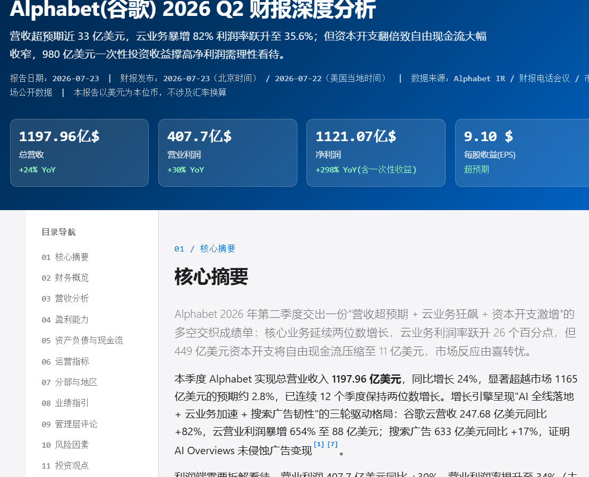
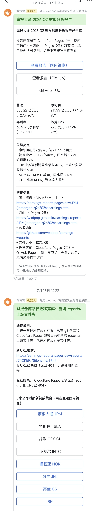

# 财报分析（earnings-reports）

SKILL 自动监控公司库并生成的上市公司财报深度分析报告，自动部署到 Cloudflare Pages（必选）+ GitHub Pages（可选）并推送到飞书机器人；如果觉得好用，请留下你的小星星 ⭐。

---

## ★ 技能简介

本仓库包含 **2 个独立但可组合的 Skill**，分别覆盖「按需手动生成」和「自动定时调度」两类场景：

| 技能 | 定位 | 核心能力 | 是否依赖另一技能 |
|------|------|---------|---------------|
| **earnings-report**（子技能） | 执行层 | 1 句话「分析 XX 财报」→ 自动生成自包含 HTML 财报深度分析报告 | **不依赖父技能，可独立安装使用** |
| **earnings-report-orchestrator**（父技能） | 编排层 | 定时调度 + 公司库管理 + 就绪检查 + 自动调用子技能 | 依赖子技能（兄弟目录引用） |

### 工作流程对比

**子技能工作流程**（10 阶段，按需手动触发）：

```
用户输入公司名 + 财报季度
    ↓
阶段 -1：环境检查 → 阶段 0：解析输入
    ↓
阶段 1：数据拉取（★ 并行：API + WebFetch 多站点）
    ↓
阶段 2：数据整理 + 汇率换算
    ↓
阶段 3：生成 sections JSON + charts.js
    ↓
阶段 4：模板填充（含结构校验）→ 阶段 5：单文件构建 → 阶段 6：无头浏览器验证
    ↓
阶段 7-9：并行执行（资源清理 + 部署 + 飞书推送）
```

**父技能工作流程**（编排层，1 句话初始化）：

```
"请执行初始化"
    ↓
步骤 1：加载父技能配置
    ↓
步骤 2：★ 信息收集前置（由子技能 collect-user-info.py 代理收集 6 项）
    │   工作根目录 + 调度间隔 + API Key + Webhook + 公司库 + 部署方案
    ↓
步骤 3：Python 前提项检测 + LLM 自动安装
    ↓
步骤 4：调用子技能 check-and-install.py（生成 .env-check-result 缓存）
    ↓
步骤 5：校验子技能缓存
    ↓
步骤 6：引导用户编辑 config.local.json（占位符检测由子技能脚本统一执行）
    ↓
步骤 6.5：Cloudflare API Token + GitHub 可选登录（引导文案由子技能脚本输出）
    ↓
步骤 7：同步配置到子技能目录（父→子复制，时机后移到收集完成后）
    ↓
步骤 8：导入公司库（如美股 7 巨头）
    ↓
步骤 9：写入父技能初始化标记
    ↓
步骤 10：★ 自动创建定时任务（Schedule 工具，默认每 12 小时）
    ↓
步骤 11：输出初始化完成摘要
```

> **★ 关键**：**子技能可单独安装使用，不需要安装父技能**。如需自动化定时调度多家公司，再安装父技能。

---

## ★ 效果展示

### PC 端预览



### 移动端预览


### 飞书推送效果



---

## ★ 一键安装 Skill

通过 [skills.sh](https://skills.sh) 开放技能生态，**一行命令**即可将技能安装到所有支持的 AI 编程工具（Trae / Trae CN / Claude Code / Cursor / Codex 等 70+ Agent）。

### 方式 A：父 + 子双技能组合安装（推荐，支持自动定时调度）

```powershell
# 1. 安装子技能（先安装）
npx skills add https://github.com/wxdpop/earnings-reports/tree/main/earnings-report-skill -g -a "*" -y --skill earnings-report

# 2. 安装父技能（后安装，父技能会通过兄弟目录引用子技能）
npx skills add https://github.com/wxdpop/earnings-reports/tree/main/earnings-report-orchestrator-skill -g -a "*" -y --skill earnings-report-orchestrator
```

### 方式 B：仅安装子技能（按需手动生成，无定时调度）

```powershell
npx skills add https://github.com/wxdpop/earnings-reports/tree/main/earnings-report-skill -g -a "*" -y --skill earnings-report
```

### 方式 C：仅安装到指定 Agent（如 Trae CN 中国版）

```powershell
# 父 + 子组合（仅 Trae CN）
npx skills add https://github.com/wxdpop/earnings-reports/tree/main/earnings-report-skill -g -a trae-cn -y --skill earnings-report
npx skills add https://github.com/wxdpop/earnings-reports/tree/main/earnings-report-orchestrator-skill -g -a trae-cn -y --skill earnings-report-orchestrator

# 仅子技能（仅 Trae CN）
npx skills add https://github.com/wxdpop/earnings-reports/tree/main/earnings-report-skill -g -a trae-cn -y --skill earnings-report
```

### 参数说明

| 参数 | 含义 | 必填 |
|------|------|------|
| `https://github.com/wxdpop/earnings-reports/tree/main/earnings-report-xxx` | Skill 所在的 GitHub 子目录 URL | 是 |
| `-g` | 全局安装（用户级，所有项目可用） | 是 |
| `-a "*"` | 安装到所有支持的 Agent（Trae/Trae CN/Claude Code/Cursor/Codex 等） | 是 |
| `-a trae-cn` | 仅安装到指定 Agent（可多选，空格分隔） | 二选一 |
| `-y` | 跳过交互确认 | 是 |
| `--skill <name>` | 指定要安装的 Skill 名称（`earnings-report` 或 `earnings-report-orchestrator`） | 是 |

### 前提条件

- **Node.js 22+**（npx 运行所需）：
  - Windows：`winget install OpenJS.NodeJS.LTS`
  - Mac：`brew install node`
  - Linux（Ubuntu/Debian）：`sudo apt-get install nodejs npm`
  - Linux（CentOS/RHEL）：`sudo yum install nodejs`

### Skill 安装目录

| Agent | 子技能安装路径 | 父技能安装路径 |
|-------|--------------|--------------|
| Trae CN | `~/.trae-cn/skills/earnings-report/` | `~/.trae-cn/skills/earnings-report-orchestrator/` |
| Trae | `~/.trae/skills/earnings-report/` | `~/.trae/skills/earnings-report-orchestrator/` |
| Claude Code | `~/.claude/skills/earnings-report/` | `~/.claude/skills/earnings-report-orchestrator/` |
| Cursor | `~/.cursor/skills/earnings-report/` | `~/.cursor/skills/earnings-report-orchestrator/` |
| Codex | `~/.codex/skills/earnings-report/` | `~/.codex/skills/earnings-report-orchestrator/` |

> **★ 父子目录关系**：父技能和子技能必须安装在**同一个父目录**下（兄弟目录关系），父技能通过相对路径 `../earnings-report` 引用子技能。skills.sh 全局安装默认满足此要求。

### 其他常用命令

```powershell
# 查看已安装的 Skill
npx skills list

# 检查 Skill 更新
npx skills check

# 更新所有 Skill 到最新版本
npx skills update

# 卸载 Skill
npx skills remove earnings-report
npx skills remove earnings-report-orchestrator

# 搜索 skills.sh 上的其他 Skill
npx skills find "财报"
```

### 安装后配置

一键安装命令**仅安装 Skill 本身**（SKILL.md + scripts/ + references/ + templates/），不会自动安装依赖和创建配置文件。安装完成后：

- **仅安装子技能**：在 Trae 对话中说「检查环境」，AI 会自动调用 `check-and-install.py` 引导完成剩余配置
- **父 + 子组合安装**：在 Trae 对话中说「请执行初始化」，AI 会按 11 步流程引导完成全部配置（详见 [父技能使用方式](#父技能使用方式)）

---

## 更新 Skill

重新执行安装命令即等于更新（skills CLI 会覆盖安装最新版本）：

```powershell
# 更新子技能到最新版本
npx skills add https://github.com/wxdpop/earnings-reports/tree/main/earnings-report-skill -g -a "*" -y --skill earnings-report

# 更新父技能到最新版本
npx skills add https://github.com/wxdpop/earnings-reports/tree/main/earnings-report-orchestrator-skill -g -a "*" -y --skill earnings-report-orchestrator
```

---

## ★ 使用方式

### 子技能使用方式（earnings-report）

子技能提供 3 种使用方式：

#### 方式一：在 Trae IDE 中调用（推荐）

在 Trae 对话中直接说：

```
分析特斯拉最新财报
分析英伟达 2026 Q2 财报
分析阿里巴巴 earnings
分析阿斯利康 2026 Q1 业绩
```

AI 会自动按 10 阶段工作流执行，无需手动指定参数。

#### 方式二：手动按阶段执行（调试/集成场景）

```bash
# 阶段 -1：环境检查 + 自动安装
python "{skill_dir}/scripts/check-and-install.py" --fix-config

# 阶段 1.1：API 数据拉取（Finnhub + Alpha Vantage）
python "{skill_dir}/scripts/fetch-data.py" --symbol "TSLA" --out-dir "{output_dir}/data/tsla-q2-2026"

# 阶段 4：模板填充（含结构完整性校验）
python "{skill_dir}/scripts/fill-template.py" \
    --template-file "{skill_dir}/references/report-template.md" \
    --sections-file "{output_dir}/data/tsla-q2-2026-sections.json" \
    --output-file "{output_dir}/tsla-q2-2026-earnings/index.html"

# 阶段 5：单文件构建
python "{skill_dir}/references/build-standalone.py" --source-dir "{output_dir}/tsla-q2-2026-earnings"

# 阶段 6：无头浏览器验证
python "{skill_dir}/references/verify-headless.py" "{repo_dir}/reports/TSLA/tsla-q2-2026-earnings.html"
```

#### 方式三：被父技能自动调度

如已安装父技能 `earnings-report-orchestrator`，则无需手动调用本子技能。父技能定时任务命中财报发布日 → 就绪检查全 PASS → 自动调用本子技能 10 阶段工作流。

📖 详见：[子技能 README](./earnings-report-skill/README.md)

---

### 父技能使用方式（earnings-report-orchestrator）

#### 触发词一览

| 触发词 | 行为 |
|--------|------|
| **「请执行初始化」** / "初始化父技能" / "init parent" | ★ 1 句话触发完整 11 步初始化流程 |
| "添加公司 XXX 到财报库" / "入库 NVDA" | 添加公司到公司库 |
| "列出财报公司库" / "查看公司库" | 查看公司库 |
| "检查今天有哪些公司要发财报" / "今日财报日历" | 查询今日待发布财报公司 |
| "启动定时任务" / "暂停定时任务" / "修改调度间隔" | 管理定时任务 |
| "为 NVDA 生成财报报告" | 手动触发，跳过就绪检查直接生成 |
| "检查 NVDA 财报就绪状态" | 手动触发就绪检查 |

#### 1 句话初始化

安装父技能后，在 Trae 对话中说：

```
请执行初始化
```

AI 会按 11 步流程自动完成：

1. **加载父技能配置**：基于当前技能安装路径推断 `parent_skill_dir`、`child_skill_dir`
2. **★ 信息收集前置**（由子技能 `collect-user-info.py --mode proxy` 代理收集 6 项）：
   - 调用子技能脚本输出弹窗规范 JSON → LLM 执行 AskUserQuestion → 回传答案 → 脚本写入父技能 config.local.json
   - 收集项：工作根目录 / 调度间隔 / API Key 状态 / 飞书 Webhook / 公司库导入方案 / 部署方案
3. **Python 前提项检测 + LLM 自动安装**：检测到 Python 不存在时直接调用 winget/brew/apt 安装
4. **调用子技能环境检测脚本**：执行 `check-and-install.py`，9 项依赖并行检查 + 自动安装
5. **校验子技能缓存**：确认 `.env-check-result.{platform}.json` 生成且 `all_pass=true`
6. **引导用户编辑 config.local.json**：读取步骤 2 输出 JSON 的 `placeholders_remaining` 字段，按 `next_actions` 输出注册地址
7. **同步配置到子技能目录**：父→子复制（去除 `child_skill_dir`/`parent_skill_dir`/`python_executable`/`schedule` 字段），时机后移到收集完成后
8. **导入公司库**：从步骤 2 输出 JSON 的 `company_library_choice` / `company_library_tickers` 字段读取方案
9. **写入父技能初始化标记**：`.parent-init-done.json`（标记值从步骤 2 输出 JSON 读取）
10. **★ 自动创建定时任务**：通过 TRAE `Schedule` 工具创建（cron 从父技能 config.local.json 的 `schedule.cron` 读取）
11. **输出初始化完成摘要**

#### 定时任务调度行为（静默规则）

定时任务触发后，默认静默运行，仅在特定情况输出：

| 场景 | 输出行为 |
|------|---------|
| 初始化标记不存在 / 未通过 | 弹窗提示初始化 |
| 公司库为空 | **完全静默**，不输出任何内容 |
| 当天无财报更新（library-manager today 返回空） | **完全静默**，不输出任何内容 |
| 当天有财报但未正式发布（就绪检查未通过） | 仅输出「XX公司当日有财报更新计划，正式财报还没有发布，等待下一次调度执行」 |
| 当天有财报且已正式发布（就绪检查全 PASS） | 调用子技能生成报告，完成后输出生成摘要 |

#### 手动触发跳过就绪检查

```
为 NVDA 生成财报报告
```

直接调用子技能 `dispatch-child-skill.py`，跳过阶段 2 就绪检查。适用于：
- 用户明确要求立即生成
- 财报已发布多日，定时任务未触发
- 测试子技能链路

📖 详见：[父技能 SKILL.md](./earnings-report-orchestrator-skill/SKILL.md)

---

## ★ 配置文件与 API Key 注册

### 配置文件加载策略

| 文件 | 用途 | 是否提交 git |
|------|------|-------------|
| `config.example.json` | 模板文件，含占位符和说明 | ✅ 提交（已脱敏） |
| `config.local.json` | 真实配置文件 | ❌ 不提交（.gitignore 排除） |

- **唯一入口**：`config.local.json`（不再支持环境变量，降低复杂性）
- **★ 信息收集入口**：统一由子技能 `collect-user-info.py` 代理（standalone 模式独立收集，proxy 模式被父技能调用写入父技能 config）
- **父技能配置文件**：`{parent_skill_dir}/config.local.json`（由子技能 `collect-user-info.py --mode proxy` 写入）
- **子技能配置文件**：`{child_skill_dir}/config.local.json`（父技能初始化步骤 7 父→子复制同步）

### 创建配置文件

```bash
# 子技能（独立使用时手动创建）
Copy-Item "<skill_dir>\config.example.json" "<skill_dir>\config.local.json"
# 或通过环境检查脚本自动创建
python "<skill_dir>\scripts\check-and-install.py" --fix-config

# 父技能（初始化时自动创建，无需手动操作）
# 父技能初始化步骤 1 会自动从 config.example.json 复制模板
```

### config.local.json 配置示例

**子技能 config.local.json**：

```json
{
  "feishu": {
    "webhook_url": "<your-feishu-webhook-url>"
  },
  "finnhub": {
    "api_key": "<your-finnhub-api-key>"
  },
  "alphavantage": {
    "api_key": "<your-alphavantage-api-key>"
  },
  "paths": {
    "output_dir": "",
    "repo_dir": ""
  }
}
```

**父技能 config.local.json**（包含 deployment 和 schedule 字段；以下为完整字段示例，默认仅启用 Cloudflare，如需追加 GitHub 请将 targets 改为 `["cloudflare", "github"]` 并设 `github.enabled=true`）：

```json
{
  "child_skill_dir": "",
  "parent_skill_dir": "",
  "feishu": { "webhook_url": "<your-feishu-webhook-url>" },
  "finnhub": { "api_key": "<your-finnhub-api-key>" },
  "alphavantage": { "api_key": "<your-alphavantage-api-key>" },
  "paths": { "output_dir": "", "repo_dir": "" },
  "deployment": {
    "targets": ["cloudflare"],
    "cloudflare": {
      "api_token": "<your-cloudflare-api-token>",
      "account_id": "<your-cloudflare-account-id>"
    },
    "github": { "enabled": false, "repo": "" }
  },
  "schedule": {
    "enabled": true,
    "cron": "0 0,12 * * *",
    "timezone": "Asia/Shanghai"
  }
}
```

### ★ API Key / Webhook / Token 注册流程

**所有 API Key、Webhook、Token、部署站点账号的注册和获取流程，请参阅完整文档**：

> 📖 [注册和 Token 获取方式（完整文档）](./注册和Token获取方式.md) — 分站点挨个说明，包含 Finnhub、Alpha Vantage、飞书、Cloudflare、GitHub 的注册和 Token 获取完整流程

简要对照表：

| 配置项 | 用途 | 是否必选 | 获取方式 | 是否提交 git |
|--------|------|---------|---------|-------------|
| `finnhub.api_key` | API 数据拉取（公司 profile、分析师评级） | 必选 | [Finnhub 注册](https://finnhub.io/register) | 否（.gitignore 排除） |
| `alphavantage.api_key` | API 数据拉取（三大报表） | 必选 | [Alpha Vantage 注册](https://www.alphavantage.support/free-api-key) | 否（.gitignore 排除） |
| `feishu.webhook_url` | 飞书群推送 | 必选（可跳过） | 飞书群 → 群机器人 → 添加自定义机器人 | 否（.gitignore 排除） |
| `deployment.cloudflare.api_token` | Cloudflare Pages 部署 | 必选（与 GitHub 二选一） | [Cloudflare API Tokens](https://dash.cloudflare.com/profile/api-tokens) | 否（.gitignore 排除） |
| `deployment.cloudflare.account_id` | Cloudflare 账户标识 | 必选（与 GitHub 二选一） | Cloudflare Dashboard 右侧栏 | 否（.gitignore 排除） |
| `deployment.github.enabled` | GitHub 部署开关 | 可选 | targets 含 github 时 true | 否（.gitignore 排除） |
| `deployment.github.repo` | GitHub 仓库地址 | 可选 | `用户名/仓库名` | 否（.gitignore 排除） |
| `paths.output_dir` | 报告输出目录 | 必选 | 父技能初始化时由 LLM 询问工作根目录后填写 | 否（.gitignore 排除） |
| `paths.repo_dir` | git 仓库目录 | 必选 | 同 `paths.output_dir` | 否（.gitignore 排除） |
| `config.example.json` | 配置模板 | — | 仓库已提供 | 是（已脱敏） |

### 部署方案组合

| 部署方案 | `deployment.targets` | 飞书推送链接来源 | 是否需要 GitHub 登录 |
|---------|---------------------|----------------|---------------------|
| 仅 Cloudflare Pages（推荐默认） | `["cloudflare"]` | Cloudflare 主链接 | 否 |
| Cloudflare + GitHub 双节点 | `["cloudflare", "github"]` | Cloudflare 主链接 + GitHub 备用 | 是 |

> **★ 约束**：Cloudflare 始终必选（不可关闭）；GitHub 为可选项，默认不启用。

### 路径配置说明

★ 路径分类规则（区分两类目录）：

| 字段 | 含义 | 目录类型 | 默认值 |
|------|------|---------|--------|
| `paths.output_dir` | 报告输出根目录 | **输出目录**（用户工作空间） | `<工作根目录>/Output/stock-financial-reports`（需用户填写） |
| `paths.repo_dir` | git 仓库根目录 | **输出目录**（用户工作空间） | 同 `paths.output_dir`（需为 git 仓库根目录） |

> **★ 关键规则**：输出/仓库目录**不从技能安装路径推断**，必须由用户显式填写。
>
> - **独立使用本子技能时**：手动编辑 `config.local.json` 填写
> - **被父技能调度时**：父技能初始化弹窗 0 询问工作根目录后自动填写

### 验证配置生效

```bash
# 运行环境检查脚本（自动检查 9 项依赖与配置）
python "<skill_dir>/scripts/check-and-install.py"

# 预期输出：所有检查项为 [PASS]
```

---

## ★ 仓库目录结构

```
earnings-reports/                                  # GitHub 仓库根
├── .gitattributes                                 # 强制 LF 换行符规范
├── .gitignore                                     # 排除 config.local.json 等敏感文件
├── README.md                                      # 本文档（仓库总览）
├── 注册和Token获取方式.md                          # ★ API Key / Webhook / Token 注册完整流程
├── Description/                                   # 效果截图目录
│   ├── 展示效果PC.png                             # PC 端预览图
│   ├── 展示效果 移动端.jpg                        # 移动端预览图
│   └── 飞书收到的效果.jpg                         # 飞书推送效果图
├── reports/                                       # ★ 财报报告统一存放目录（按公司股票代码大写分文件夹）
│   ├── JPM/                                       # 摩根大通
│   ├── TSLA/                                      # 特斯拉
│   ├── GOOGL/                                     # 谷歌
│   ├── INTC/                                      # 英特尔
│   ├── NOK/                                       # 诺基亚
│   ├── JNJ/                                       # 强生
│   ├── GS/                                        # 高盛
│   ├── IBM/                                       # IBM
│   ├── AZN/                                       # 阿斯利康
│   ├── BABA/                                      # 阿里巴巴
│   ├── NVDA/                                      # 英伟达
│   ├── NFLX/                                      # 网飞
│   ├── UNH/                                       # 联合健康
│   ├── RKLB/                                      # Rocket Lab
│   ├── HOOD/                                      # Robinhood
│   └── NBIS/                                      # Nebius Group
├── earnings-report-skill/                         # ★ 子技能源码（执行层，可独立使用）
│   ├── SKILL.md                                   # 技能主配置文件
│   ├── README.md                                  # 子技能文档
│   ├── config.example.json                        # 配置文件模板（已脱敏，提交到 git）
│   ├── config.local.json                          # 真实配置（★ 被 .gitignore 排除，不提交）
│   ├── assets/js/echarts.min.js                   # ★ echarts@5.5.0 内置库（1MB）
│   ├── references/                                # 参考资源与构建/验证/推送脚本（统一 Python）
│   │   ├── report-template.md                     # HTML 报告模板
│   │   ├── charts-template.js                     # ECharts 图表模板（7 个固定图表）
│   │   ├── build-standalone.py                    # 单文件构建脚本（跨平台 Python 3）
│   │   ├── verify-headless.py                     # 无头浏览器验证脚本（跨平台 Python 3）
│   │   └── send-feishu.py                         # 飞书群推送脚本（跨平台 Python 3）
│   ├── scripts/                                   # 核心脚本（统一 Python 单文件入口）
│   │   ├── check-and-install.py                   # 环境检查 + 自动安装（跨平台）
│   │   ├── fetch-data.py                          # API 数据拉取（Finnhub + Alpha Vantage）
│   │   ├── fill-template.py                       # 模板填充（含结构完整性校验）
│   │   └── parse-financial-data.py                # 财务数据解析（fetch-data 自动调用）
│   └── templates/
│       └── sections-reference.md                  # 各 section 必需子元素规范
├── earnings-report-orchestrator-skill/            # ★ 父技能源码（编排层，依赖子技能）
│   ├── SKILL.md                                   # 父技能主配置文件
│   ├── config.example.json                        # 父技能配置模板
│   ├── config.local.json                          # 父技能真实配置（.gitignore 排除）
│   ├── company-library.json                       # ★ 公司库数据（核心数据，可提交）
│   ├── .parent-init-done.json                     # 父技能初始化标记（.gitignore 排除，运行时生成）
│   ├── .gitignore                                 # 排除敏感文件
│   ├── scripts/                                   # ★ 全部 Python 跨平台
│   │   ├── library-manager.py                     # 公司库 CRUD
│   │   ├── earnings-calendar.py                   # 财报日历拉取（Finnhub / IR）
│   │   ├── readiness-check.py                     # 就绪检查三项（财报+电话会+媒体）
│   │   └── dispatch-child-skill.py                # 子技能调度器
│   └── scheduler/
│       └── cron-task-definition.md                # 定时任务调度规范
└── (生成产物)
    ├── .env-check-result.windows.json             # 子技能环境检测缓存（Windows，.gitignore 排除）
    ├── .env-check-result.macos.json               # 子技能环境检测缓存（Mac，.gitignore 排除）
    └── .env-check-result.linux.json               # 子技能环境检测缓存（Linux，.gitignore 排除）
```

### 子技能目录结构

📖 详见：[earnings-report-skill/README.md](./earnings-report-skill/README.md#技能目录结构)

### 父技能目录结构

📖 详见：[earnings-report-orchestrator-skill/SKILL.md](./earnings-report-orchestrator-skill/SKILL.md#目录结构)

---

## ★ 环境依赖（跨平台，跨 Agent）

### 运行时依赖（9 项，check-and-install.py 自动检测 + 安装）

| # | 依赖项 | 版本要求 | 用途 | Windows 安装 | Mac/Linux 安装 |
|---|--------|---------|------|-------------|---------------|
| 1 | Python | 3.8+ | 所有脚本运行前提（★ 必选） | `winget install Python.Python.3.12` | `brew install python@3.12` / `sudo apt-get install python3` |
| 2 | Node.js | 18+（推荐 22+） | wrangler / skills.sh 运行环境 | `winget install OpenJS.NodeJS.LTS` | `brew install node@18` / NodeSource |
| 3 | Google Chrome | 稳定版 | 无头浏览器验证 | `winget install Google.Chrome` | `brew install --cask google-chrome` / apt 添加 Google 源 |
| 4 | Git | 2.x | 仓库管理 | `winget install Git.Git` | `brew install git` / `sudo apt-get install git` |
| 5 | GitHub CLI (gh) | 最新 | GitHub Pages 部署 | `winget install GitHub.cli` | `brew install gh` / apt 添加 GitHub 源 |
| 6 | wrangler | 4.x | Cloudflare Pages 部署 | `npm i -g wrangler`（国内用 npmmirror） | `npm i -g wrangler`（国内用 npmmirror） |
| 7 | PowerShell | 7+ | 可选（部分场景使用） | `winget install Microsoft.PowerShell` | Mac/Linux 可选 |
| 8 | config.local.json | — | 配置文件 | `--fix-config` 自动创建 | `--fix-config` 自动创建 |
| 9 | git 仓库 | — | 报告存放与部署 | 检查 `.git` + remote origin | 检查 `.git` + remote origin |

> **国内 IP 自动启用镜像源**：npm 淘宝 `registry.npmmirror.com` / pip 清华 `pypi.tuna.tsinghua.edu.cn` / Homebrew 清华 / apt 清华。或通过 `--china` 强制启用。

### 跨平台支持

| 平台 | 状态 | 备注 |
|------|------|------|
| Windows 10 1709+ | ✅ 完整支持 | 推荐 winget 安装依赖 |
| macOS 11+ | ✅ 完整支持 | 推荐 Homebrew 安装依赖 |
| Linux（Ubuntu/Debian/CentOS/RHEL） | ✅ 完整支持 | apt / yum 包管理器 |

**★ 跨平台实现方式**：所有脚本统一为 Python 3 单文件入口（不再提供 .ps1 / .sh 双版本），通过 `platform.system()` 在脚本内部判定平台并选择对应的安装命令 / Chrome 路径，无需用户介入。

### 跨 Agent 支持（通过 skills.sh 安装）

| Agent | 子技能安装路径 | 父技能安装路径 | 状态 |
|-------|--------------|--------------|------|
| Trae CN | `~/.trae-cn/skills/earnings-report/` | `~/.trae-cn/skills/earnings-report-orchestrator/` | ✅ 完整支持 |
| Trae | `~/.trae/skills/earnings-report/` | `~/.trae/skills/earnings-report-orchestrator/` | ✅ 完整支持 |
| Claude Code | `~/.claude/skills/earnings-report/` | `~/.claude/skills/earnings-report-orchestrator/` | ✅ 完整支持 |
| Cursor | `~/.cursor/skills/earnings-report/` | `~/.cursor/skills/earnings-report-orchestrator/` | ✅ 完整支持 |
| Codex | `~/.codex/skills/earnings-report/` | `~/.codex/skills/earnings-report-orchestrator/` | ✅ 完整支持 |
| 其他 70+ Agent | 各 Agent skills 目录 | 各 Agent skills 目录 | ✅ 通过 skills.sh 通用安装 |

> **★ Trae 专有能力**（其他 Agent 可降级）：
> - `Schedule` 工具 → 系统级 cron 替代
> - `AskUserQuestion` → 命令行 stdin 替代
> - `Task` 子代理 → 串行执行 / Python multiprocessing 替代
> - `WebFetch` → Python `requests` 替代

### 环境检查缓存机制

- 全部 PASS 后结果保存到 `.env-check-result.{platform}.json`（按平台分文件，永久有效）
- 下次运行直接读取缓存秒级通过
- `--force-check` 强制重检（忽略缓存）
- 缓存文件被 `.gitignore` 排除

---

## ★ 技术栈

| 类别 | 技术 | 版本要求 | 用途 |
|------|------|---------|------|
| 脚本语言 | Python | 3.8+ | 所有脚本统一入口（Windows/Mac/Linux 通用） |
| 运行时 | Node.js | 18+（推荐 22+） | wrangler、skills.sh 安装工具 |
| 前端图表库 | ECharts | 5.5.0（内置） | SVG 渲染、响应式图表，标签强制简体中文 |
| 无头浏览器 | Google Chrome | 稳定版 | `--headless --dump-dom` 页面渲染验证 |
| API 数据源 | Finnhub + Alpha Vantage | — | 公司 profile、分析师评级、三大报表 |
| 版本控制 | Git | 2.x | 仓库管理、GitHub Pages 部署 |
| CI/CD | GitHub CLI (gh) + wrangler | — | 部署（Cloudflare 必选 + GitHub 可选） |
| 配置管理 | JSON | — | config.local.json / config.example.json |
| 换行符规范 | .gitattributes | — | 强制 LF 换行，跨平台一致 |
| 文件编码 | UTF-8 无 BOM LF | — | 所有 `.py` 文件统一编码 |

---

## ★ 部署架构（Cloudflare 必选 + GitHub 可选）

| 节点 | URL 格式 | 适用场景 | 优先级 |
|------|---------|---------|--------|
| **Cloudflare Pages** | `https://earnings-reports.pages.dev/reports/{TICKER}/{filename}.html` | 境内境外均可（必选主链接） | ★ 必选 |
| GitHub Pages（可选） | `https://wxdpop.github.io/earnings-reports/reports/{TICKER}/{filename}.html` | 境外备份（deployment.targets 含 github 时启用） | 可选备份 |

**为什么 Cloudflare Pages 为必选主链接？**

- GitHub Pages 在境内访问不稳定，偶发抽风
- Cloudflare Pages 在境内有 CDN 节点，访问稳定、速度快，不会被墙
- GitHub 为可选备节点，默认不启用，需要时在 deployment.targets 追加 "github"

### 如何添加新报告

1. 将新生成的 HTML 文件放入 `reports/` 下的对应公司文件夹（按公司股票代码大写命名，如 `reports/TSLA/`、`reports/ASML/`）
2. 提交到 git 仓库：
   ```bash
   git add .
   git commit -m "Add {公司名} {季度} earnings report"
   git push
   ```
3. 同步到 Cloudflare Pages（主节点）：
   ```bash
   npx wrangler pages deploy <deploy-dir> --project-name=<从 deployment.github.repo 提取仓库名> --branch=main --commit-dirty=true
   ```
4. GitHub Pages 会自动部署，访问 URL 格式：`https://wxdpop.github.io/earnings-reports/reports/{TICKER}/{filename}.html`

> **★ 提示**：如使用本技能，阶段 8 自动完成上述部署步骤，无需手动操作。

---

## ★ 已验证公司

> 以下公司财报报告均由本技能自动生成，并已在 Windows / Mac / Linux 三平台验证脚本可正常执行。报告存放在 `reports/{TICKER}/` 目录下。

| 公司 | 代码 | 报告链接 | 在线访问 |
|------|------|---------|---------|
| 摩根大通（JPMorgan Chase & Co.） | JPM | [2026 Q2 报告](./reports/JPM/jpmorgan-q2-2026-earnings.html) | [GitHub Pages](https://wxdpop.github.io/earnings-reports/reports/JPM/jpmorgan-q2-2026-earnings.html) / [国内镜像](https://earnings-reports.pages.dev/reports/JPM/jpmorgan-q2-2026-earnings.html) |
| 特斯拉（Tesla, Inc.） | TSLA | [2026 Q2 报告](./reports/TSLA/tsla-q2-2026-earnings.html) | [GitHub Pages](https://wxdpop.github.io/earnings-reports/reports/TSLA/tsla-q2-2026-earnings.html) / [国内镜像](https://earnings-reports.pages.dev/reports/TSLA/tsla-q2-2026-earnings.html) |
| 谷歌（Alphabet Inc.） | GOOGL | [2026 Q2 报告](./reports/GOOGL/alphabet-q2-2026-earnings.html) | [GitHub Pages](https://wxdpop.github.io/earnings-reports/reports/GOOGL/alphabet-q2-2026-earnings.html) / [国内镜像](https://earnings-reports.pages.dev/reports/GOOGL/alphabet-q2-2026-earnings.html) |
| 英特尔（Intel Corporation） | INTC | [2026 Q2 报告](./reports/INTC/intel-q2-2026-earnings.html) | [GitHub Pages](https://wxdpop.github.io/earnings-reports/reports/INTC/intel-q2-2026-earnings.html) / [国内镜像](https://earnings-reports.pages.dev/reports/INTC/intel-q2-2026-earnings.html) |
| 诺基亚（Nokia Corporation） | NOK | [2026 Q2 报告](./reports/NOK/nok-q2-2026-earnings.html) | [GitHub Pages](https://wxdpop.github.io/earnings-reports/reports/NOK/nok-q2-2026-earnings.html) / [国内镜像](https://earnings-reports.pages.dev/reports/NOK/nok-q2-2026-earnings.html) |
| 强生（Johnson & Johnson） | JNJ | [2026 Q2 报告](./reports/JNJ/jnj-q2-2026-earnings.html) | [GitHub Pages](https://wxdpop.github.io/earnings-reports/reports/JNJ/jnj-q2-2026-earnings.html) / [国内镜像](https://earnings-reports.pages.dev/reports/JNJ/jnj-q2-2026-earnings.html) |
| 高盛（Goldman Sachs Group） | GS | [2026 Q2 报告](./reports/GS/gs-q2-2026-earnings.html) | [GitHub Pages](https://wxdpop.github.io/earnings-reports/reports/GS/gs-q2-2026-earnings.html) / [国内镜像](https://earnings-reports.pages.dev/reports/GS/gs-q2-2026-earnings.html) |
| IBM（International Business Machines） | IBM | [2026 Q2 报告](./reports/IBM/ibm-q2-2026-earnings.html) | [GitHub Pages](https://wxdpop.github.io/earnings-reports/reports/IBM/ibm-q2-2026-earnings.html) / [国内镜像](https://earnings-reports.pages.dev/reports/IBM/ibm-q2-2026-earnings.html) |
| 阿斯利康（AstraZeneca PLC） | AZN | [2026 Q1 报告](./reports/AZN/astrazeneca-q1-2026-earnings.html) | [GitHub Pages](https://wxdpop.github.io/earnings-reports/reports/AZN/astrazeneca-q1-2026-earnings.html) / [国内镜像](https://earnings-reports.pages.dev/reports/AZN/astrazeneca-q1-2026-earnings.html) |
| 阿里巴巴（Alibaba Group） | BABA | [2026 Q1 报告](./reports/BABA/alibabagroupholdingltd-q1-fy2026-earnings.html) | [GitHub Pages](https://wxdpop.github.io/earnings-reports/reports/BABA/alibabagroupholdingltd-q1-fy2026-earnings.html) / [国内镜像](https://earnings-reports.pages.dev/reports/BABA/alibabagroupholdingltd-q1-fy2026-earnings.html) |
| 英伟达（NVIDIA Corporation） | NVDA | [2026 Q1 报告](./reports/NVDA/nvidia-q1-2026-earnings.html) | [GitHub Pages](https://wxdpop.github.io/earnings-reports/reports/NVDA/nvidia-q1-2026-earnings.html) / [国内镜像](https://earnings-reports.pages.dev/reports/NVDA/nvidia-q1-2026-earnings.html) |
| 网飞（Netflix, Inc.） | NFLX | [2026 Q2 报告](./reports/NFLX/netflix-q2-2026-earnings.html) | [GitHub Pages](https://wxdpop.github.io/earnings-reports/reports/NFLX/netflix-q2-2026-earnings.html) / [国内镜像](https://earnings-reports.pages.dev/reports/NFLX/netflix-q2-2026-earnings.html) |
| 联合健康（UnitedHealth Group） | UNH | [2026 Q2 报告](./reports/UNH/unitedhealth-q2-2026-earnings.html) | [GitHub Pages](https://wxdpop.github.io/earnings-reports/reports/UNH/unitedhealth-q2-2026-earnings.html) / [国内镜像](https://earnings-reports.pages.dev/reports/UNH/unitedhealth-q2-2026-earnings.html) |
| Rocket Lab（Rocket Lab USA） | RKLB | [2026 Q1 报告](./reports/RKLB/rocketlab-q1-2026-earnings.html) / [2026 Q2 报告](./reports/RKLB/rocketlab-q2-2026-earnings.html) | [GitHub Pages](https://wxdpop.github.io/earnings-reports/reports/RKLB/rocketlab-q1-2026-earnings.html) / [国内镜像](https://earnings-reports.pages.dev/reports/RKLB/rocketlab-q1-2026-earnings.html) |
| Robinhood（Robinhood Markets） | HOOD | [2026 Q1 报告](./reports/HOOD/hood-q1-2026-earnings.html) | [GitHub Pages](https://wxdpop.github.io/earnings-reports/reports/HOOD/hood-q1-2026-earnings.html) / [国内镜像](https://earnings-reports.pages.dev/reports/HOOD/hood-q1-2026-earnings.html) |
| Nebius Group | NBIS | [2026 Q1 报告](./reports/NBIS/nebis-q1-2026-earnings.html) | [GitHub Pages](https://wxdpop.github.io/earnings-reports/reports/NBIS/nebis-q1-2026-earnings.html) / [国内镜像](https://earnings-reports.pages.dev/reports/NBIS/nebis-q1-2026-earnings.html) |

> 涵盖多元行业：金融（JPM/GS/HOOD）、科技（GOOGL/IBM/INTC/NVDA/NFLX/NBIS）、汽车（TSLA/RKLB）、通信（NOK）、医疗（JNJ/UNH/AZN）、电商（BABA），验证技能对不同行业财报的适配能力。

---

## ★ 报告特性

- **单文件输出**：所有 JS/CSS 内联，无外部依赖，体积约 1-1.2 MB
- **7 个 ECharts 图表**：SVG 渲染、响应式、移动端适配、标签强制简体中文
- **左侧侧边栏目录**：桌面端固定侧边栏（160px）+ 移动端抽屉式菜单 + 滚动高亮
- **12 章节结构**：核心摘要 → 财务概览 → 营收分析 → ... → 投资观点 → 附录
- **移动端兼容**：两档断点（700px / 480px），全元素适配
- **部署**：Cloudflare Pages（必选主链接）+ GitHub Pages（可选备节点）
- **★ 跨平台支持**：Windows / Mac / Linux 三平台，统一 Python 3 单文件入口
- **★ 跨 Agent 支持**：通过 skills.sh 安装到 Trae / Claude Code / Cursor / Codex 等 70+ Agent

---

## ★ 相关文档

- 📖 [注册和 Token 获取方式](./注册和Token获取方式.md) — 所有 API Key、Webhook、Token 注册流程（必读）
- 📖 [子技能 README](./earnings-report-skill/README.md) — earnings-report Skill 详细文档
- 📖 [子技能 SKILL.md](./earnings-report-skill/SKILL.md) — 子技能工作流程规范
- 📖 [父技能 SKILL.md](./earnings-report-orchestrator-skill/SKILL.md) — 父技能编排调度规范
- 📖 [定时任务调度规范](./earnings-report-orchestrator-skill/scheduler/cron-task-definition.md) — cron 表达式与 message 模板
- 📖 [Section 结构规范](./earnings-report-skill/templates/sections-reference.md) — 各 section 必需子元素

---

## 许可证

MIT License - 可自由使用、修改、分发。
